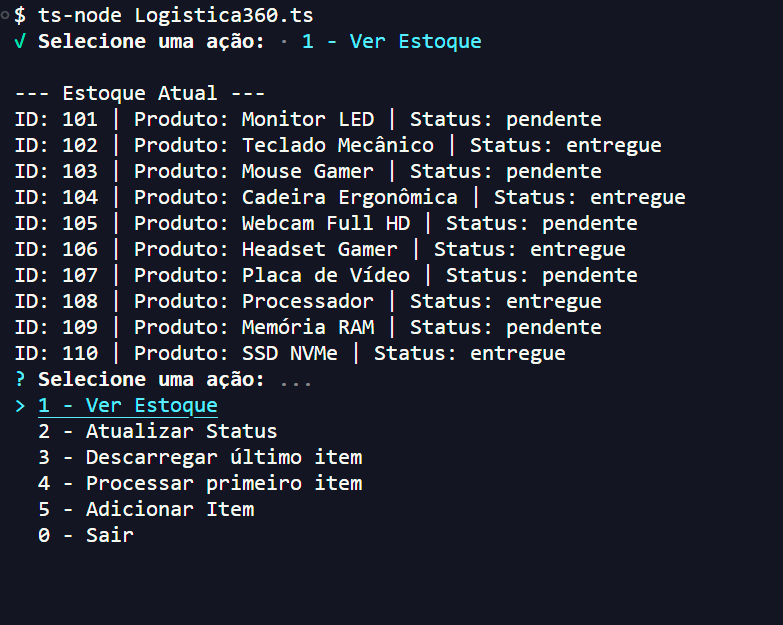

<h1 align="center">📦 Logística 360 — Sistema CLI de Gestão de Estoque</h1>

<p align="center">
  Sistema de gerenciamento de fluxo de estoque via linha de comando (CLI), focado em eficiência, tipagem estrita e integridade de dados.
</p>

<p align="center">
  Este projeto foi totalmente desenvolvido por mim, <strong>Jean Pedro</strong>.
</p>

<p align="center">
  
</p>

## 🎯 Objetivo

Este projeto foi desenvolvido com o objetivo de consolidar conhecimentos em TypeScript, manipulação de dados e construção de aplicações em linha de comando, simulando cenários reais de logística.

## 🚀 Sobre o Projeto

O **Logística 360** é uma ferramenta CLI (Command Line Interface) desenvolvida para gerenciar fluxos logísticos. O sistema permite o cadastro, rastreio e processamento de produtos, garantindo a integridade dos dados através de validações rigorosas em TypeScript, como a prevenção de IDs duplicados utilizando estruturas de `Set`.

## 🛠️ Tecnologias e Ferramentas

<p align="left">
  
</p>

- **TypeScript:** Utilizado com configurações de tipagem estrita para garantir segurança em tempo de desenvolvimento.
- **Node.js:** Ambiente de execução para a lógica de back-end.
- **Enquirer:** Biblioteca utilizada para criar uma interface de terminal interativa e amigável.
- **Lógica de Dados:** Implementação de manipulação de arrays para fluxos de entrada e saída (LIFO/FIFO).

## ⚙️ Funcionalidades Principais

- **Gestão de Estoque:** Visualização detalhada de todos os itens e seus respectivos status.
- **Filtros de Pendência:** Identificação rápida de produtos que ainda precisam de processamento.
- **Lógica de Processamento:** Funções dedicadas para descarregar o último item ou processar a fila de entrada.
- **Validação em Tempo Real:** Sistema que impede o cadastro de IDs repetidos ou entradas inválidas.

## 💡 Diferenciais Técnicos

Este projeto não é apenas um script simples; ele foi construído seguindo boas práticas de desenvolvimento moderno:

- **Tipagem Estrita:** Uso de interfaces e tipos customizados para garantir que o fluxo de dados entre funções seja à prova de erros.
- **Integridade de Dados:** Implementação da estrutura de dados `Set` para garantir que IDs de produtos sejam únicos, otimizando a busca e prevenindo duplicidade no banco de dados simulado.
- **Programação Assíncrona:** Uso de `async/await` para gerenciar a interface de linha de comando sem travar a execução do sistema.
- **Clean Code:** Separação clara entre a lógica de negócio (gestão de produtos) e a interface de interação com o usuário.

## 📂 Como Acessar e Executar

Para rodar o projeto em sua máquina local, utilize os comandos abaixo no seu terminal:

```bash
# 1. Clonar o repositório
git clone [https://github.com/jjeanpedro03/Logistica360.git](https://github.com/jjeanpedro03/Logistica360.git)

# 2. Acessar o diretório e instalar as dependências
cd Logistica360 && npm install

# 3. Iniciar a aplicação
npm start
